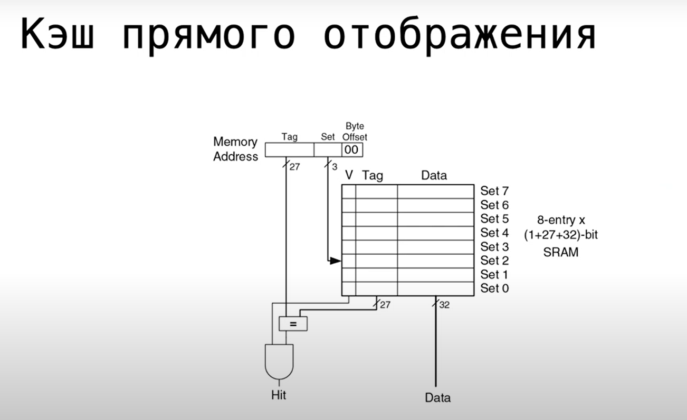
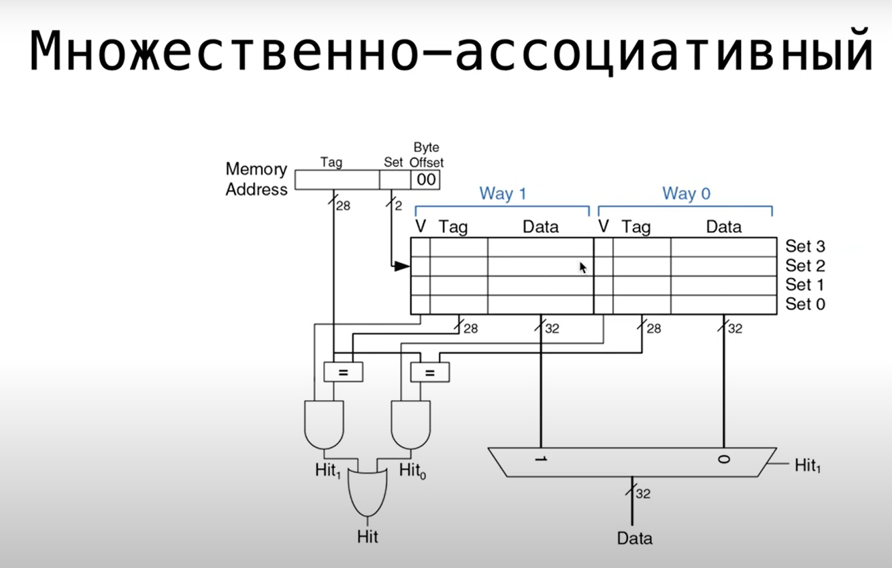
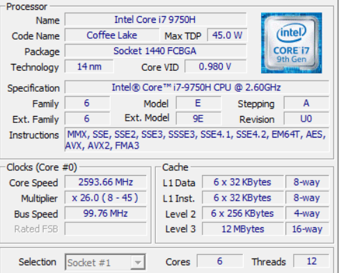

# Experemental determination of cache\'s degree of associativity
### Cache characteristics:
* hit 
* miss
* direct mapping cache
* set associate cache
* full associate cache
* principle of locality
* hit rate = hits / calls to memory = miss rate - 1
* miss rate = misses / calls to memory = hit rate - 1
* AMAT - average memory access time = time to cache + MR * (time to main memory + miss rate main memory * time to virtual memory)
* cache capacity
* number of sets
* block length
* amount of blocks = capacity / block length
* degree of associativity
* evict
* translation lookaside buffer
### How cache work:

### Test proccessor characteristics

